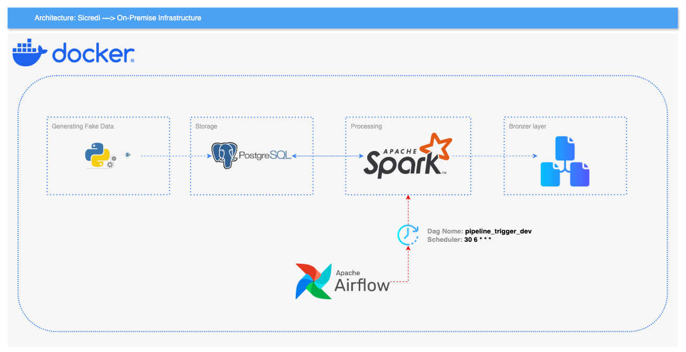
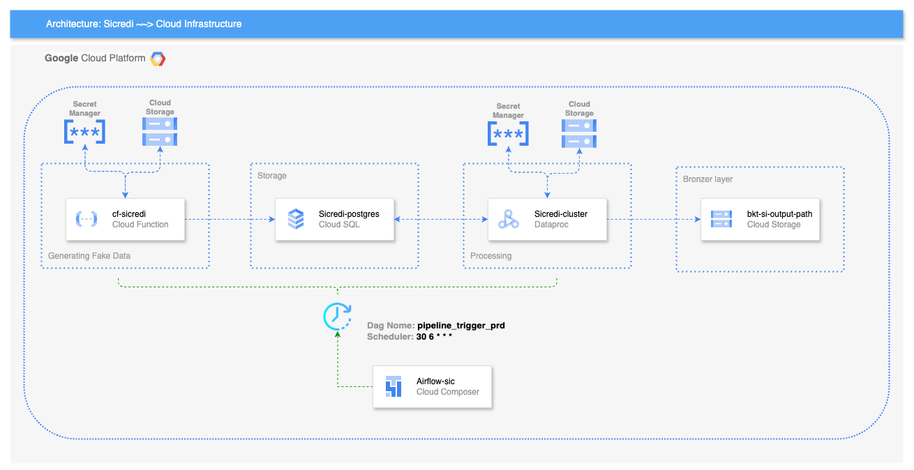

🚧 IN PROGRESING ..... 🚧

# Sicredi Challenge Data Engineer

- Project objective:
    - Create the structure of the database to be ingested, using the technology of your choice (MySQL, PostgreSQL).
    - Insert a fictitious mass of data into the tables, it doesn't have to be a large volume.
    - Use the programming language of your choice.
    - To ETL the data, use a distributed processing framework for Big Data, e.g.
    - processing framework for Big Data, e.g. Hadoop, Spark, Flink and Storm.
    - Write a CSV file in a directory parameterized by the user.
    - Make this project available in a private repository on your GitHub.


## General Summary
The challenge used Python 3.11.8 and Spark 3.5.4. To run the code locally, you need to download the project by making a `Git clone` and install the dependencies needed to run the code. All the commands below are executed in the **CMD**, in the **project root folder**.


I recommend that you use one of the options below to create the environment:

- On-Premise
    - make deploy-spark-dev  ~~> Trigger work by airflow
    - make exec-job-dev      ~~> Trigger work without using the airflow

- Cloud (GCP)
    - make deploy-spark-prd  ~~> Trigger work by airflow ( Composer )


**Observation:** *To destroy the environment, you can replace [ deploy ] with [ destroy ] in the commands above!*

## On-Premise Infrastructure


## Cloud Infrastructure ( GCP )


## Code structure
```
.
├── sicredi_challange
├─ configs
│  ├─ pipe
│  │  ├─ variables
│  │  │  └─ pipeline_trigger_prd.json
│  │  ├─ pipeline_trigger_dev.py
│  │  └─ pipeline_trigger_prd.py
│  └─ terraform
│     ├─ modules
│     │  ├─ cloud_function
│     │  │  ├─ main.tf
│     │  │  ├─ output.tf
│     │  │  └─ variable.tf
│     │  ├─ cloud_sql
│     │  │  ├─ main.tf
│     │  │  ├─ output.tf
│     │  │  └─ variables.tf
│     │  ├─ composer
│     │  │  ├─ main.tf
│     │  │  ├─ output.tf
│     │  │  └─ variable.tf
│     │  ├─ gcs
│     │  │  ├─ main.tf
│     │  │  ├─ output.tf
│     │  │  └─ variables.tf
│     │  ├─ iam
│     │  │  ├─ main.tf
│     │  │  ├─ output.tf
│     │  │  └─ variables.tf
│     │  └─ secret_manager
│     │     ├─ main.tf
│     │     ├─ output.tf
│     │     └─ variable.tf
│     ├─ scripts
│     ├─ .terraform.lock.hcl
│     ├─ config.tf
│     ├─ main.tf
│     ├─ terraform.tfvars
│     └─ variables.tf
├─ docker/
│  ├─ ci/
│  │  └─ Dockerfile
│  ├─ conf/
│  │  └─ spark-defaults.conf
│  ├─ data/
│  ├─ drivers/
│  │  ├─ dataproc/
│  │  │  └─ install_secret_manager.sh
│  │  ├─ init.sql
│  │  └─ postgresql-42.7.4.jar
│  ├─ jobs/
│  │  └─ app_spark.py
│  ├─ src/
│  │  ├─ modules/
│  │  │  ├─ __init__.py
│  │  │  ├─ conn_postgres.py
│  │  │  ├─ fake_data.py
│  │  │  └─ secret_manager.py
│  │  ├─ __init__.py
│  │  ├─ index.zip
│  │  ├─ main.py
│  │  ├─ requirements-dev.txt
│  │  ├─ requirements.txt
│  │  └─ setup.py
│  ├─ test/
│  │  ├─ __init__.py
│  │  ├─ test_app_spark.py
│  │  ├─ test_conn_postgres.py
│  │  ├─ test_fake_data.py
│  │  ├─ test_main.py
│  │  └─ test_secret_manager.py
│  ├─ .env_db
│  ├─ docker-compose.yml
│  ├─ Dockerfile
│  ├─ entrypoint.sh
│  ├─ Makefile
│  └─ requirements.txt
├─ docs
│  ├─ cloud_infrastructure.png
│  ├─ Desafio técnico engenharia de dados.pdf (pt-br)
│  ├─ on_premise_Infrastructure.png
│  ├─ README.md
│  └─ Technical challenge data engineering.pdf (en-us)
├─ .gitignore
├─ .gitlab-ci.yml
├─ .python-version
├─ Makefile
└─ README.md
```

## Como esses pipelines são executados
The [airflow Scheduler](https://airflow.apache.org/docs/apache-airflow/2.10.5/administration-and-deployment/scheduler.html). Currently, these aggregations are carried out once a day:

- Every day at 6:30 A.M. (UTC).


## Referências

- GitLab:
    - [Document GitLab](https://docs.gitlab.com)
    - [Documemt GitLab Clone](https://docs.gitlab.com/ee/gitlab-basics/start-using-git.html)
    - [Document GitLab CI/CD](https://docs.gitlab.com/ee/ci/)

- Terraform:
    - [Document Terraform](https://developer.hashicorp.com/terraform/intro)
    - [Document Terraform Google](registry.terraform.io/providers/hashicorp/google/6.24.0)

- Python:
    - [Document Python](https://docs.python.org/3.11/)
    - [Document Polars](https://pola-rs.github.io/polars/py-polars/html/index.html)
    - [Book Polars](https://pola-rs.github.io/polars-book/)
    - [Document Pytest](https://docs.pytest.org/en/8.3.x/contents.html)
    - [Document Coverage](https://coverage.readthedocs.io/en/7.6.12/)

- Apache-Spark
    - [Document API-SPARK](https://spark.apache.org/docs/3.5.4/index.html)
    - [Document PySpark Auxiliary](https://sparkbyexamples.com/pyspark)

- Airflow:
    - [Document Airflow](https://airflow.apache.org/docs/apache-airflow/2.10.2/index.html)

- Google Cloud (Google Cloud Platform):
    - [Document Composer](https://cloud.google.com/composer/docs/composer-3/composer-overview)
    - [Document Cloud Storage](https://cloud.google.com/storage/docs)
    - [Document Cloud Sql](https://cloud.google.com/sql/docs)
    - [Document DataProc](https://cloud.google.com/dataproc/docs)
    - [Document Secret Manager](https://cloud.google.com/secret-manager/docs)
    - [Document IAM](https://cloud.google.com/iam/docs)
    - [Document Cloud Run Functions](https://cloud.google.com/functions/docs)

- Docker:
    - [Document Docker](https://docs.docker.com)
    - [Docker Airflow](https://hub.docker.com/r/apache/airflow)

- Makefile
    - [Document Makefile](https://www.gnu.org/software/make/manual/make.html)
    - [Document Tutorial Makefile](https://makefiletutorial.com)


| Versão Do Document |        Editor      |    Data    |  Percentage Complete  |
|        :---:       |        :---:       |    :---:   |         :---:         |
|        3.3.0       | Matheus S. Silva   | 2024-03-20 |          92%          |


#TODO: implement git action ( Migration GitLab )